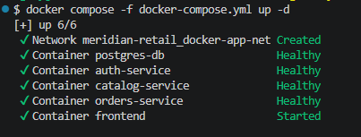
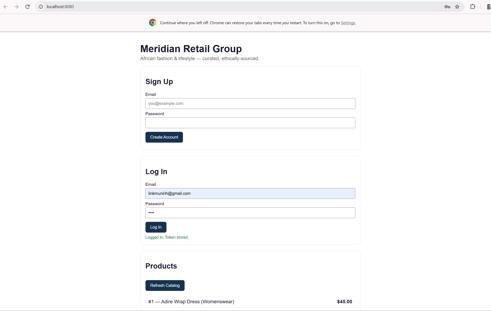

# Local Development

How to run the full Meridian Retail stack locally with Docker Compose.

## Prerequisites

- Docker and Docker Compose installed
Each of auth-service/, catalog-service/, orders-service/, and frontend/ has its own Dockerfile (compose builds from source locally, unlike production, which pulls pre-built images from ECR)

1. Create your local .env

In the project root, create a .env file (copy .env.example if one is kept up to date, or create it fresh) with the variables docker-compose.yml references.

These don't need to match production values — they're only used on your machine.

2. Build and start everything
```bash
docker compose -f docker-compose.yml up -d
```


1. Expect a staggered startup

The compose file has real dependency ordering, not just a flat list of services:

db (Postgres) must report healthy first — up to a ~40s start period
auth-service and catalog-service start once db is healthy
orders-service starts once both of those are healthy
frontend starts once orders-service is healthy

On a first run this can take a minute or two. That's expected — it isn't stuck.

4. Confirm everything is healthy
```bash
docker compose ps
```

Every backend service should show healthy; frontend shows running (it has no healthcheck defined). If something shows unhealthy or keeps restarting:

```bash
docker compose logs -f <service-name>
```

5. Access the app
   
App	URL
Frontend	http://localhost:8080



6. Shut down

```bash
docker compose down
```
This stops and removes containers but keeps database data (stored in the db_data named volume). To also wipe the database and start from a clean slate:

```bash
docker compose down -v
```